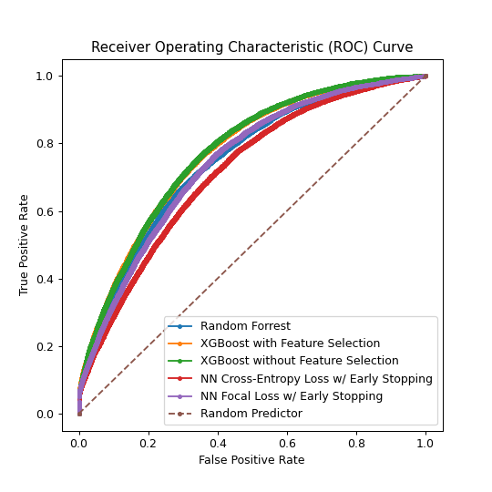
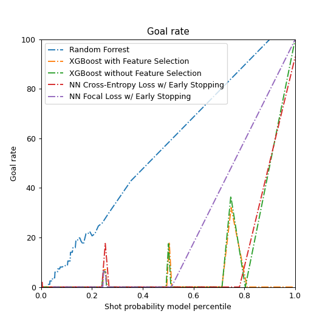
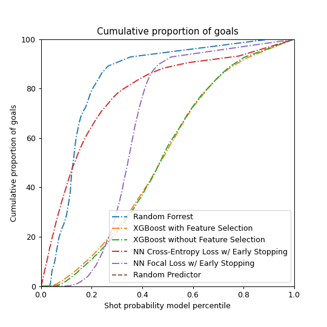
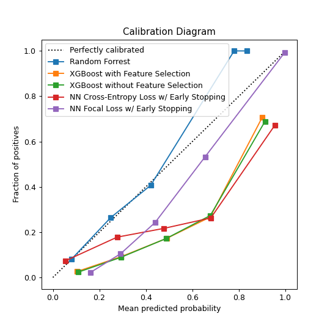
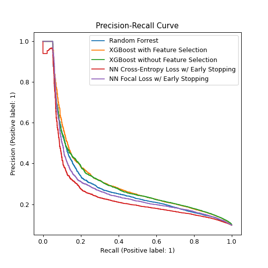

## Task 2: Feature Engineering I

## Task 3: Baseline Models
### Question 1

## Task 4: Feature Engineering II

## Task 5: Advanced Models
# XGBoost models 

### Question 1

In order to enhance  the performance of our models of predicting if an event is a goal or not, we used the  train-validation split procedure. The validation data enables us to fine-tune the model hyperparameters and make decisions regarding what changements we can apply to have better result. The validation set affects indirectly the model. 
In our case, we are working with very few hyperparameters, thus the size of our dataset is not very huge (20%) of the training Data.  
 
Link to comet: 

### Question 2

**Hyperparameter tuning setup:** 
 
we are using the "binary:hinge"  loss for binary classification. This makes predictions of 0 or 1, rather than producing probabilities.
 

The **learning rate** is controlled by the ETA parameter. It defines the amount of "correction" we perform at each phase by corresponding to the shrinking of the weights associated with features after each cycle. A smaller eta strengthens our model's resistance to overfitting, therefore the lower the learning rate, the better.

**Tuning the Number of Decision Trees in XGBoost:**
 
We run a **grid search**  of the n estimators (number of decison trees) model parameter with scikit-learn, assessing this sequence of values (50, 150, 200, 250, 300, 350,400) We note that the  default in the XGBoost library is 100 . In order to evaluate the results of each configuraton we use F1 score. We obtain the best results 350. 

**Results:**  
After running each model, we study the accuracy and F1 score(combination of recall and precision). The confusion matrix should illustrate perfectly these metrics.

<figure>

<figcaption style="text-align:center;">Figure 5.1:Confusion Matrix_XGboost Tuned, input:  all features</figcaption>
</figure>

- Links to experiments in *comet.ml*:
    - [Link to the experiment of dataset statistics in comet.ml](https://www.comet.ml/meriembchaaben/ift6758/b65854538ffd4dddaf1378a9679e23f1)
    - [Link to experiments of Logistic Regression (distance) in comet.ml ](https://www.comet.ml/meriembchaaben/ift6758/fbea37d0aa6d46a488c82cb6fe912fb0)
    - [Link to experiments of Logistic Regression (angle) in comet.ml ](https://www.comet.ml/meriembchaaben/ift6758/a0a1675d0895408faf2f476f91cf6e89)

- Links to registered models:

### Question 3

We proceed first by styudying the **correlation between the features** so we plot the following plot: 
<figure>

<figcaption style="text-align:center;">Figure 5.1: Features correlation</figcaption>
</figure>
  
We notice that gameseconds and period features  are very correlated. LasteventGameSeconds and period too. 
Thanks to such results we were able to remove redudant features.
In the next experiments we should be reducing  this redudancy by neglecting the **period** feature.

We also notice that **distanceFromTheNet** is the feature the most correlated with our target feature **goal**.
This feature should be present in all the coming experiments.
Some correlation values are explainable such as the speed and the distance from last Event (proportional).

From the  previous task, we can extract a set of important features based on fitted trees and this using the predifined libray plotting method plot_importance, we obtain the following plot: 
<figure>

<figcaption style="text-align:center;">Figure 5.1: Features Importance regarding XGboost</figcaption>
</figure>
  
Another tool we used to check what features are actually enhancing the prediction accuracy; SHAP library. 
we obtain this plot: 
<figure>

<figcaption style="text-align:center;">Figure 5.1: SHAP features selected</figcaption>
</figure>

  
The idea then is to run an XGboost model with only the Features pushing the prediction higher (shown in red) ['changeInAngleShot','lastEventXCoord','angle','distanceFromNet'].
Results: 
<figure>

<figcaption style="text-align:center;">Figure 5.1:Confusion Matrix_XGboost Tuned, input:  Selected  features by SHAP</figcaption>
</figure>
  
A second option was to run **Lasso**:
  

In this case only two features are suggested to be selected: ['distanceFromNet', 'speed']. We peroform then a second XGboost with the already tuned  parameters previously but this time using these two features and a feature related to previousEvent. 
We obtain these results. 
<figure>

<figcaption style="text-align:center;">Figure 5.1:Confusion Matrix_XGboost Tuned, input:  selected features by Lasso</figcaption>
</figure>
  

**Feature Selection using Wrapper methods:** 
 
We thought about using Feature importance scores  for feature selection and this was done by using selectFromModel class already provided by sklearn. Athreshold is provided to this method to select a set of features, in our case (wrapper method) this threshold is obtained after first training  and then evaluating an XGBoost model on the entire training dataset and test datasets respectively.

| Classifier                                  | AUC of ROC  |brier_score_loss|
|---------------------------------------------|:----------:|:----------:|
| XGboost (distanceFromNet & angle)           | 0.5014     | 0.0934     |
| XGboost All features                        | 0.5026     | 0.0935     |  
| XGboost SHAP features                       |0.5017      |  0.0948    |
| XGboost Lasso features (angle+distance)     |0.5045      | 0.0950     | 
| Random baseline with uniform distribution   | 0.5        |            |       

## Task 6: Give it your best shot! 
### Overview
In this section we attempt several new ideas in order to achieve better accuracy, compared to previous sections. 

Some of these techniques were very successful (ex. tree-based methods) others were less successful (ex. NN-based methods).

In the next section we will outline the methods and techinques we've attempted, followed by our top 5 most notable results, and we will end with a brief discussion.

### Methods and Techniques
In order to improve our models' accuracy _(and achieve full marks)_, in this section we explore the following additional approaches:

1. [x] Data Train/Validation split using a **Time-Series Split**
2. [x] **Hyperparameter Tuning** using **Cross Validation**
3. [x] **Regularization** of model weights, to improve generalization / avoid overfitting
4. [x] Additional **Feature Selection** Techniques
   - [x] Model Weight-Based Feature Selection, using Support Vector Machines
   - [x] Recursive Feature Elimination-based Feature Selection, using Naive Bayes, Random Forrest and XGBoost Models
5. [x] Additional Models
   - [x] **Random Forest**
   - [x] **Neural Network** Models, 
   - [x] with different Loss functions
     - [x] Cross Entropy Loss
     - [x] Focal Loss
   - [x] with different Learning Rate policies
     - [x] One-Cycle Policy
     - [x] Stochastic Gradient Descent with Warm Restarts (SGDR) Learning Rate Policy
6. [x] Additional **Accuracy Metrics**
   - [x] **F1 Score**, Macro average, to emphasize minority class predictive accuracy
   - [x] **Brier Score**, to measure accuracy of predicted probabilities 

### Summary of Results (Top 5)

|Classifier                                          |AUC of ROC (+) |F1 (Macro Average) (+) |Brier Score (-) |Comet link                                                                  |
|----------------------------------------------------|----------|------------------|-----------|----------------------------------------------------------------------------|
|Random Forest                                       |0.75     |0.53             |**0.09**      |[Details](https://www.comet.ml/meriembchaaben/ift6758/561f6ad677da470986f66c916519e9cf)|
|Feature Selection + XGBoost + Regularization        |0.77     |0.61             |0.17      |[Details](https://www.comet.ml/meriembchaaben/ift6758/6b56e4f49b6740548f83d6a16c13dc6d)|
|**XGBoost + Regularization + Grid Search [BEST MODEL]**              |**0.77**     |**0.61**             |0.17      |[Details](https://www.comet.ml/meriembchaaben/ift6758/16c4746d9f314fa9b0038911ee4cdfac)|
|Neural Network (cross entropy loss, early stopping) |0.54     |0.55             |0.09      |[Details](https://www.comet.ml/meriembchaaben/ift6758/3533c1ad47bf4d53b53edccf0de74f1e)|
|Neural Network (focal loss, gamma=2, early stopping)|0.55     |0.56             |0.10      |[Details](https://www.comet.ml/meriembchaaben/ift6758/dd864f6af8094e1ab1c19fbcb4115278)|

<!-- |Neural Network (focal loss, gamma=2, no early stopping)|0.56      |0.558             |0.159      |[Details](https://www.comet.ml/meriembchaaben/ift6758/9128c55a6c5e402ea8f1a6e660e89994)| -->

**Table 6.1:** Summary of results, validation set, top 5 best models. Top 1 Best (and final) model and best results in **bold**.

**Note**: For accuracy metrics, (+) means higer is better, (-) means lower is better.

### Our Best Model
Our best model (ROC AUC=0.774) was **XGBoost** `XGBClassifier` with :
1. No Explicit Feature Selection
2. `L1`, `L2`, and tree pruning **regularization**, 
3. **Hyperparameter Tuning** using **Cross Validation** (n=5) on a Time Series data split (`TimeSeriesSplit`) (i.e. using 5 equal-length, consecutive, non-overlappping validation sets).

Our preprocessing pipeline included:
1. Categorical Encoding, using `OrdinalEconder`
2. Missing Value Imputation (`median` for numerical, `"Missing Value"` category for categorical data)
3. Standardization, using `StandardScaler`.
To accomplish these steps we took advantage of the `sklearn` `Pipeline` functionality.
 
We selected this model, as our Best Model, due to its highest AUC ROC score among all its peers.

### Summary of Results
The best performing family of models was the Tree-based family of models.

Extreme Gradient Boosted Trees dominated across all metrics with 0.774 ROC AUC, 0.612 F1 (macro), 0.173 Brier score and were closly followed by Random Forest models with 0.748 ROC AUC, 0.525 F1 (macro), 0.091 Brier Score.

Perhaps surprisingly, Neural-Network (NN) based models were not able to fit to the data as well as Tree-based models did. 
Our best NN model achieved 0.546 ROC AUC, 0.558 F1 (macro) and 0.106 Brier score, which is worse than our best XGBoost model, with the exception of Brier scores, where lower is better.

### Detailed Comaprison of Results _(with figures)_

In this sub-section we will perform a brief quanititaive comparison of the Top 5 models. 

**Fig. 6.1:** Plot of the Receiver Operating Characteristic (ROC) curve for our top 5 models.

Our selected model, XGBoost without Feature Selection has the highest area under the ROC curve (AUC ROC). 

**Fig. 6.2:** Plot of Shot Probability percentile vs Goal rate for our top 5 models.

Although the XGBoost model has the best AUC ROC, it does not have the best correlation between the predicted Shot Probability percentile and Goal rate. Instead the Random Forrest Model shines here. 

This is due to the fact that XGBoost was trained using Log Loss, which pushes the prediction values towards 0 or 1, whereas the Random Forest model was trained using Sample Accuracy, which in our case is equivalent to the Jaccard similarity coefficient score, and would not have this same effect to the same extent.

We also observe a "spiky" behavior in the plot above. This tells us that the models illustrating this behavior do not output a continuous set of probabilities, instead their output probabilites are concetrated around ceertain levels (0.23, 0.5. 0.8). 
This phenomena too, could be explained by the the difference in optimization loss function discussed above.

**Fig. 6.3:** Plot of Cumulative Shot Probability percentile vs Goal rate for our top 5 models.

This plot is simialr to the simple Shot Probability percentile vs Goal rate, illustrated above, and our results are also in line.

**Fig. 6.4:** Calibration Diagram plot for our top 5 models.

This plot describes the correlation between the Mean Predicted Probability for a set of samples and the Fraction of Positive labels in that sample set. In other words this plot tells us how close is our predicted probability of a goal, to the frequency of goals.

The Random Forrest model is the most well-calibrated model among our top 5 best perfroming models (in terms of ROC AUC). This insight was also highlighted when looking at the **Brier score**, _(see Table 1)_, as the Random Forest classifier had the lowest Brier Score Loss among its peers.

**Fig. 6.5:** Bonus plot: Precision-Recall Curves for our top 5 models.

This plot illustrated the precision-recall trade-off inherent to all classifiers. 
The higher the area under the curve (PR AUC) the better the classifier.

Interestingly we note how the Random Classifer outperformes Neural Network classifiers in this plot.

### Further Discussion of Unsucessful Models
As discussed in the Overview section, we have attempted a plethora of additional experiments which we do not have the chance to describe in detail.

Some of these experiments are:
- performing Feature Selection using Recursive Feature Elimination, based on Naive Bayes, Random Forest, and XGBoost models,
- leveraging several types of Feature Encodings (ex. One-Hot Encoding, Mean-Encoding, etc.),
- testing several accuracy metrics for Hyperparameter optimization (ex. weighted F1 score, Briar score, etc.)
- using a One-Cycle Variable Learnign-rate Policy to train a Neural Network,
- testign several values for the gamma parameter used in Stochastic Gradient Descent with Warm Restarts,
- and many more (as outlined in the Overview section).

An interesting insight is that, for this particualr problem settig, feature selection systematically yielded either a large feature set or low model accuracy, which seems to indicate that the features present carry meaningful information. This finding is consistent with our observations from Section 5.
Perhaps, a good next-step in order to further improve the accuracy of our models, woud be creating additonal, domain-epertise-based features. 

## Task 7: Evaluate on test set

